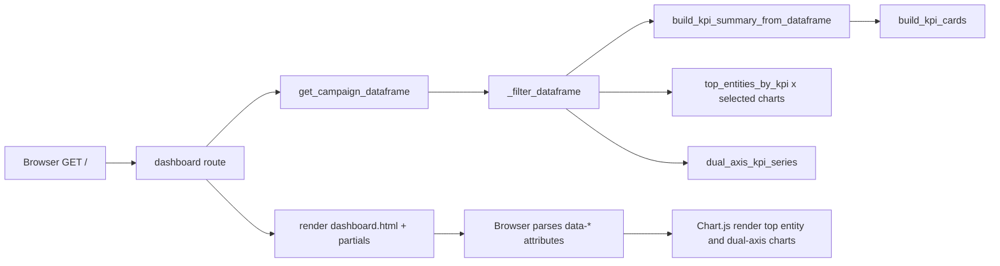
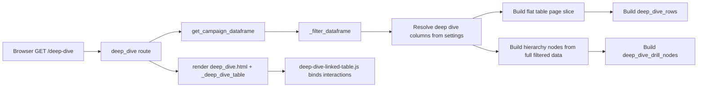

# Campaign Dashboard Data Flow

This document explains how data moves from client request → Flask endpoint → backend services → rendered HTML/JSON-like datasets → client interactions for all KPIs, charts, and tables.

## 1) Entry Points and Endpoints

- Dashboard page: GET /
- Deep Dive page: GET /deep-dive
- Deep Dive server CSV export (first table): GET /deep-dive/download-csv

Both pages are server-rendered Jinja templates and then enhanced by client-side JavaScript.

## 2) Shared Backend Pipeline

All page endpoints follow the same base pipeline before building page-specific UI data:

1. Route builds DataframeRequest with backend config and field mapping file.
2. get_campaign_dataframe loads full table from selected DB backend:
	 - sqlite: SELECT * FROM campaign_data via sqlite connection
	 - mysql: SELECT * from configured table (SQLAlchemy path with pymysql fallback)
3. apply_field_mapping normalizes source columns.
4. _filter_dataframe applies date + multi-select filters and updates session state.
5. Route computes feature-specific payloads (KPIs, charts, tables).
6. Route returns rendered HTML template.

Key files:
- backend/routes/dashboard.py
- backend/services/dataframe_service.py
- backend/services/field_mapping_service.py
- backend/services/settings_service.py

## 3) Dashboard Page (/)

## 3.1 Initial Load Flow

### KPI cards

- Backend:
	- build_kpi_summary_from_dataframe computes totals and derived KPIs.
	- build_kpi_cards formats selected KPI keys for display.
- Client:
	- Cards are static HTML from partial _kpi_grid.html.

### Top entity bar charts

- Backend:
	- For each selected chart key from settings, top_entities_by_kpi computes top N by KPI.
	- Route embeds chart rows and display metadata into canvas data-* attributes.
- Client:
	- dashboard-top-entity-charts.js reads data-* attributes and creates Chart.js horizontal bars.

### Dual-axis trend chart

- Backend:
	- dual_axis_kpi_series computes date buckets and two KPI series.
	- Route embeds labels/values in data-* attributes on #dual-axis-kpi-chart.
- Client:
	- dashboard-dual-axis-chart.js renders Chart.js line chart with left/right axes.

## 3.2 Interactive Update Flows (No Full Page Reload)

All three forms send GET with query params and fetch full HTML; JS replaces only target sections.

### A) Global filters form (.filters-form)

- JS: dashboard-filters-form.js
- Request: GET current URL with filter params.
- Response handling:
	- Replaces .filters-panel, .kpi-grid, #insights-top, #dual-axis-trend, .footer, and optional .page-header.
	- Re-initializes charts.
	- Updates browser URL via history.replaceState.

### B) Top chart KPI forms (.top-chart-kpi-form)

- JS: dashboard-top-kpi-form.js
- Request: GET / with selected top_kpi_* and preserved hidden params.
- Response handling:
	- Replaces only #insights-top.
	- Re-renders top entity charts.
	- Syncs hidden dual-axis dependency fields through DashboardSync.

### C) Trend form (.dual-axis-form)

- JS: dashboard-trend-form.js
- Request: GET / with line_kpi_left, line_kpi_right, line_granularity and preserved hidden params.
- Response handling:
	- Replaces only #dual-axis-trend.
	- Re-renders dual-axis chart.
	- Syncs hidden top chart dependency fields through DashboardSync.

## 3.3 Dashboard CSV Downloads

### KPI cards CSV

- Trigger: .kpi-download-btn
- JS: dashboard-kpi-download.js
- Data source: DOM .kpi-grid cards (already-rendered values)
- Output: client-generated Blob CSV

### Top entity chart CSV

- Trigger: .top-entity-download-btn
- JS: dashboard-top-entity-charts.js
- Data source: canvas data-* labels/values
- Output: client-generated Blob CSV

### Dual-axis trend CSV

- Trigger: .dual-axis-download-btn
- JS: dashboard-dual-axis-chart.js
- Data source: canvas data-* labels/left/right values
- Output: client-generated Blob CSV

## 4) Deep Dive Page (/deep-dive)

## 4.1 Initial Load Flow

### First table (primary Deep Dive table)

- View mode:
	- hierarchy: drill tree from deep_dive_drill_nodes using full filtered dataframe
	- flat: paged row table from deep_dive_rows
- Hierarchy order:
	- comes from available_deep_dive_hierarchy_fields ordering (restricted to selected table columns present)

### Pagination behavior

- Pagination controls appear only in flat mode.
- Hierarchy view is not paged (to avoid collapse-level page confusion).

### All Rows toggle

- all_rows=1 sets page_size to total rows for flat mode.
- all_rows=0 returns to configured/default page size.

## 4.2 Deep Dive Secondary Linked Table (Dynamic)

- JS module: deep-dive-linked-table.js
- Primary behavior:
	- Reads first table rows and details open state.
	- If rows are selected (click), linked table shows selected rows.
	- Else in hierarchy mode, linked table shows rows from expanded branches.
	- Else in flat mode, linked table mirrors visible rows.
- Persistence:
	- Linked table row payload and source label stored in sessionStorage by filter/view key.
	- Expanded node keys also stored per key.
	- Expanded restoration is gated by keep_expanded=1 query flag.

## 4.3 Deep Dive CSV Downloads

### First table CSV (server-generated)

- Endpoint: GET /deep-dive/download-csv
- Backend:
	- Re-runs dataframe load + _filter_dataframe.
	- Applies selected deep dive columns.
	- Applies paging unless all_rows=1.
	- Returns Response(text/csv) with Content-Disposition filename.

### Second linked table CSV (client-generated)

- Trigger: #deep-dive-linked-download-btn
- JS: deep-dive-linked-table.js
- Data source: current linked table header/body in DOM
- Output: client-generated Blob CSV

## 5) Filter State and Session Behavior

- Session key: top_level_filters
- _filter_dataframe stores:
	- date_from, date_to
	- selected list values for each active filter field
- Subsequent requests (without explicit params) reuse stored filter values.

## 6) Settings-Driven Controls Affecting Flows

From settings/dashboard_settings.json, route/service logic uses:

- selected_kpis
- selected_filter_fields
- selected_top_entity_charts
- selected_deep_dive_table_columns
- available_deep_dive_hierarchy_fields (ordering source)
- deep_dive_default_page_size

These settings alter what backend computes and what template sections are rendered.

## 7) Frontend Modules by Responsibility

- dashboard-dropdowns.js: multi-select dropdown open/close and clear behavior
- dashboard-filters-form.js: async global filter refresh of multiple sections
- dashboard-top-kpi-form.js: async refresh for top chart panel
- dashboard-trend-form.js: async refresh for trend panel
- dashboard-sync.js: hidden-field synchronization between independent forms
- dashboard-top-entity-charts.js: top bar chart rendering + chart CSV
- dashboard-dual-axis-chart.js: trend chart rendering + trend CSV
- dashboard-kpi-download.js: KPI cards CSV from DOM
- deep-dive-linked-table.js: linked table derive/persist/download logic
- dashboard-init.js: chart bootstrap on initial load

## 8) Field-Level Lineage

This section maps each displayed metric from source columns → transformation → final UI/API output.

### 8.1 KPI Card Lineage (Dashboard)

| KPI key | Source column(s) | Backend transformation | UI output label |
|---|---|---|---|
| total_spend | AMOUNT_SPENT | sum(AMOUNT_SPENT) | Spend |
| total_impressions | IMPRESSIONS | sum(IMPRESSIONS) | Impressions |
| total_reach | REACH | sum(REACH) | Reach |
| total_clicks | CLICKS | sum(CLICKS) | Clicks |
| total_conversions | CONVERSIONS | sum(CONVERSIONS) | Conversions |
| total_leads | LEADS | sum(LEADS) | Leads |
| total_video_views | VIDEO_VIEWS | sum(VIDEO_VIEWS) | Video Views |
| total_likes | LIKES | sum(LIKES) | Likes |
| total_video_completion | VIDEO_COMPLETION | sum(VIDEO_COMPLETION) | Video Completion |
| total_campaigns | CAMPAIGN_NAME | count unique non-empty CAMPAIGN_NAME | Unique Campaigns |
| avg_ctr_percent | CLICKS, IMPRESSIONS | (sum(CLICKS) / sum(IMPRESSIONS)) * 100 | CTR |
| avg_cpc | AMOUNT_SPENT, CLICKS | sum(AMOUNT_SPENT) / sum(CLICKS) | CPC |
| cpm | AMOUNT_SPENT, IMPRESSIONS | (sum(AMOUNT_SPENT) / sum(IMPRESSIONS)) * 1000 | CPM |
| cvv | AMOUNT_SPENT, VIDEO_VIEWS | sum(AMOUNT_SPENT) / sum(VIDEO_VIEWS) | CVV |

Formatting applied in KPI cards:
- Money-like fields use currency symbol prefix and decimal formatting.
- Count-like fields are integer-formatted with separators.

### 8.2 Top Entity Chart Lineage

Entity dimensions (depends on selected chart):
- platform → PLATFORM
- campaign_name → CAMPAIGN_NAME
- campaign_group → CAMPAIGN_GROUP
- adname → AD_NAME
- adset_name → ADSET_NAME

KPI value lineage in grouped top entity rows:
- Sum-based KPIs use grouped sums from the mapped source columns.
- Derived KPIs use grouped formulas:
	- avg_ctr_percent = grouped CLICKS / grouped IMPRESSIONS * 100
	- avg_cpc = grouped AMOUNT_SPENT / grouped CLICKS
	- cpm = grouped AMOUNT_SPENT / grouped IMPRESSIONS * 1000
	- cvv = grouped AMOUNT_SPENT / grouped VIDEO_VIEWS

Output fields per row:
- entity (dimension value)
- kpi_value (numeric, for chart plotting)
- kpi_display (formatted string, for tooltip/table-like display)

### 8.3 Dual-Axis Trend Lineage

Time axis source:
- DATE → DATE_BUCKET (daily/weekly/monthly/quarterly/yearly)

Per bucket processing:
1. Group by DATE_BUCKET
2. Sum numeric metric columns in each bucket
3. Compute left KPI and right KPI from grouped data using same KPI mapping/derived formulas as top entity charts

Output arrays bound to chart:
- labels (formatted bucket labels)
- left_values
- right_values

### 8.4 Deep Dive Primary Table Lineage

Column inclusion source:
- selected_deep_dive_table_columns from settings
- only columns present in filtered dataframe are kept

Row lineage:
- Start from filtered dataframe
- Sort by parsed DATE descending when DATE exists
- In flat mode: page slice is applied
- In hierarchy mode: full filtered set is used for drill grouping

Value transformation:
- Mostly pass-through string rendering per selected column
- Missing values rendered as empty string

### 8.5 Deep Dive Hierarchy Aggregate Lineage

Hierarchy dimensions:
- Ordered by available_deep_dive_hierarchy_fields (restricted to selected table columns and non-metric fields)

Aggregated metrics shown in each hierarchy node:
- AMOUNT_SPENT, IMPRESSIONS, CLICKS, CONVERSIONS, LEADS, REACH (only if present in selected columns)
- Each metric value is computed as sum over the node subgroup
- AMOUNT_SPENT formatted with 2 decimals; others rounded/displayed as integers

### 8.6 Deep Dive CSV Lineage

Server CSV (/deep-dive/download-csv):
- Rebuilds filtered dataset server-side
- Applies selected deep dive columns
- Applies page slicing unless all_rows=1
- Renames output headers using DEEP_DIVE_TABLE_COLUMN_DEFINITIONS

Linked table CSV (client-side):
- Exports exactly what is currently rendered in the second linked table
- Header cells from linked table thead
- Data rows from linked table tbody

### 8.7 Date Range Lineage (Header/Footer Context)

Displayed Date Range is derived from filtered dataframe date bounds:
- min(valid DATE), max(valid DATE)
- The same filter context drives KPI cards, charts, and both deep dive tables

